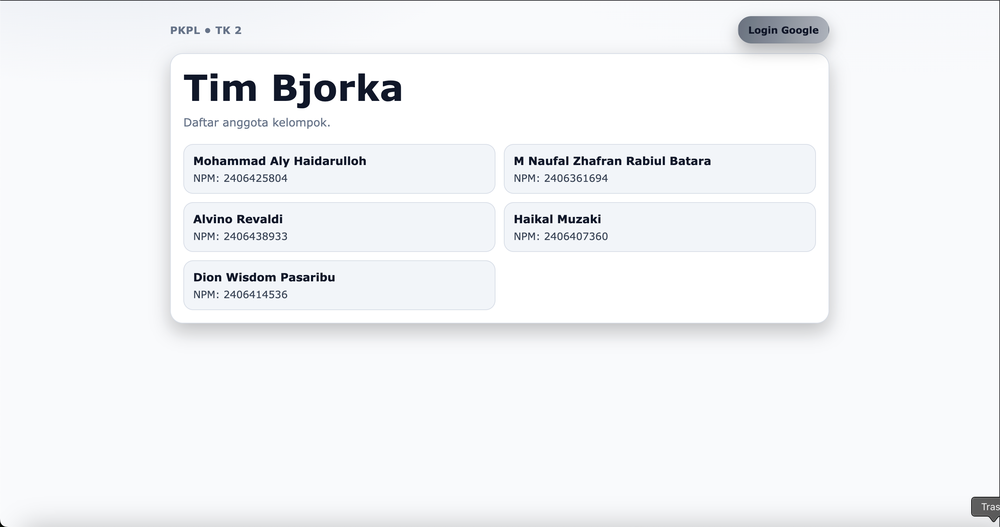
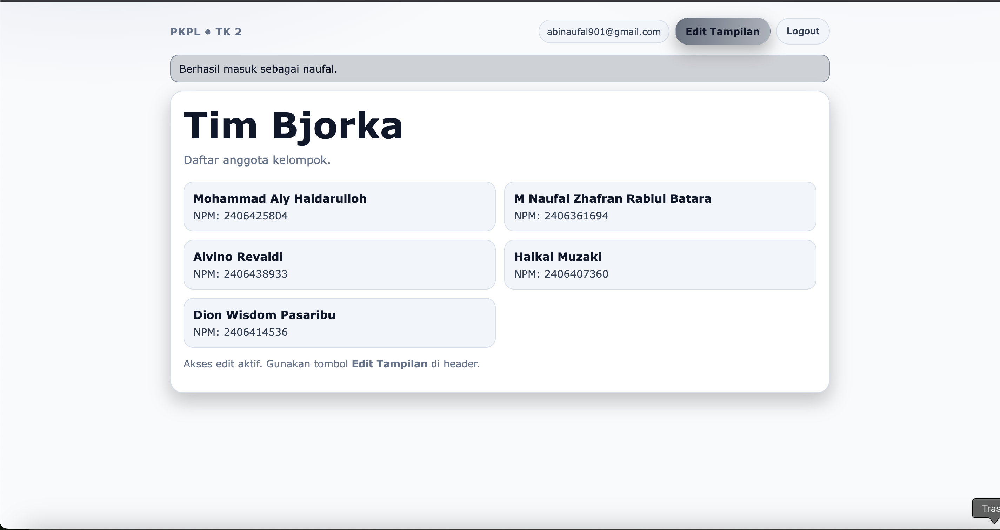
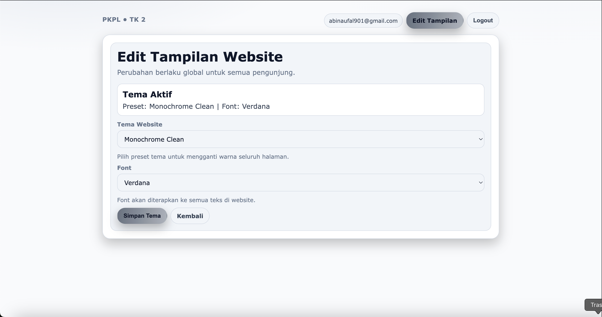
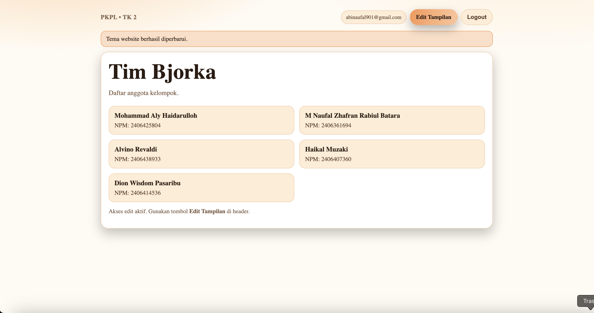
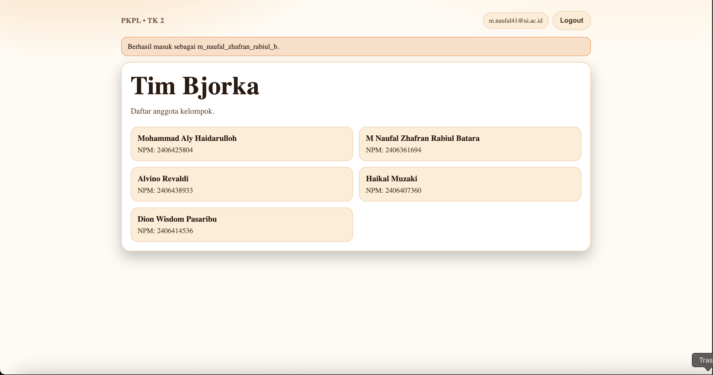

# Website Biodata Kelompok Tim Bjorka (Django)

Website ini memenuhi kebutuhan tugas:
- Biodata kelompok bisa dilihat tanpa login.
- Login menggunakan OAuth Google.
- Hanya akun anggota kelompok yang login via Google yang bisa mengubah tema (warna/font).

## 1. Jalankan Proyek

```bash
python3 -m venv .venv
source .venv/bin/activate
pip install -r requirements.txt
cp .env.example .env
python manage.py migrate
python manage.py createsuperuser
python manage.py runserver
```

## 2. Konfigurasi OAuth Google

1. Buka [Google Cloud Console](https://console.cloud.google.com/)
2. Buat OAuth Client ID (Web application).
3. Tambahkan redirect URI:
   - `http://127.0.0.1:8000/accounts/google/login/callback/`
4. Isi `.env`:
   - `GOOGLE_OAUTH_CLIENT_ID`
   - `GOOGLE_OAUTH_SECRET`
5. Jalankan:

```bash
python manage.py setup_google_oauth
```

## 3. Authorization Anggota

Daftar email anggota diatur lewat env:

```env
GROUP_MEMBER_EMAILS=abinaufal901@gmail.com, dionwisdom29@gmail.com, m.alyhaidarulloh@gmail.com, alvino0706@gmail.com, haikalmuzaki28@gmail.com
```

Akun harus memenuhi dua syarat untuk mengubah tema:
- Sudah login
- Login melalui provider Google dan email ada di daftar anggota

## 4. Struktur Fitur

- `/` halaman biodata publik
- `/accounts/login/` login Google
- `/tema/` form pilih preset tema + font global (hanya anggota yang berhak)


# Dokumen Pekerjaan

## i. Penjelasan Singkat Tentang Web yang Dibuat
Website ini menampilkan biodata kelompok **Tim Bjorka** yang dapat diakses publik tanpa login.  
Login menggunakan **OAuth Google**. Setelah berhasil login, sistem akan memeriksa hak akses pengguna.

Fitur yang tersedia:
- Melihat biodata kelompok tanpa autentikasi.
- Login menggunakan akun Google.
- Mengubah tampilan website (hanya untuk anggota kelompok yang berhak).
- Perubahan tampilan berlaku **global untuk seluruh halaman**, berupa:
  - pemilihan **preset tema** (beberapa opsi tema),
  - pemilihan **font** (beberapa opsi font).

Fokus utama implementasi mengikuti instruksi tugas: aspek security pada autentikasi dan otorisasi.

## ii. Komponen yang Digunakan
- Bahasa/Framework: `Python` + `Django 5.2`
- Authentication provider: `django-allauth` (Google OAuth)
- Database: `SQLite`
- Session & messages: Django built-in session + messages framework
- Konfigurasi lingkungan: file `.env`

Komponen aplikasi:
- Model:
  - `GroupProfile`: menyimpan identitas kelompok dan daftar anggota.
  - `SiteAppearance`: menyimpan pengaturan tampilan global (preset tema + font).
- Form:
  - `ThemeForm`: form pemilihan preset tema dan font.
- View:
  - `home`: halaman biodata publik.
  - `quick_login`: shortcut login Google atau fallback halaman instruksi setup.
  - `edit_theme`: halaman ubah tampilan, dilindungi autentikasi + otorisasi.
- Permission helper:
  - `can_edit_theme(user)`: cek apakah user berhak edit tampilan.
  - `group_member_required`: decorator pembatas akses endpoint tema.
- Template utama:
  - `templates/base.html`
  - `templates/core/home.html`
  - `templates/core/edit_theme.html`
  - `templates/account/login.html`

## iii. Mekanisme Autentikasi dan Otorisasi
### Autentikasi (Authentication)
- Mekanisme login menggunakan **OAuth 2.0 Google** melalui `django-allauth`.
- Alur autentikasi:
  1. Pengguna menekan tombol **Login Google**.
  2. Pengguna diarahkan ke halaman consent Google.
  3. Setelah berhasil, Google melakukan callback ke aplikasi Django.
  4. `django-allauth` membuat session login untuk user.

### Otorisasi (Authorization)
Akses edit tampilan pada endpoint `/tema/` dibatasi berlapis:
- `@login_required`: user harus sudah login.
- `@group_member_required`: user harus lolos validasi hak akses anggota kelompok.

Validasi hak akses (`can_edit_theme`) mensyaratkan:
- User terautentikasi.
- User login melalui provider `google` (tercatat pada `SocialAccount`).
- Email user ada pada whitelist `GROUP_MEMBER_EMAILS` di environment.

Jika tidak lolos otorisasi:
- User tidak bisa mengakses fitur ubah tampilan.
- Sistem menampilkan pesan error dan mengarahkan kembali ke halaman utama.

## iv. Screenshot Aplikasi
Alur tampilan aplikasi dari awal hingga perubahan tema:

1. **Halaman utama (publik, belum login)**


2. **User login Google dan terotorisasi sebagai anggota**
   (tombol **Edit Tampilan** muncul)


3. **Halaman Edit Tampilan**
   (pilih preset tema dan font, berlaku global)


4. **Hasil setelah tema berhasil diubah**


5. **User login Google tetapi bukan anggota yang berhak edit**
   (tidak ada tombol **Edit Tampilan**)


